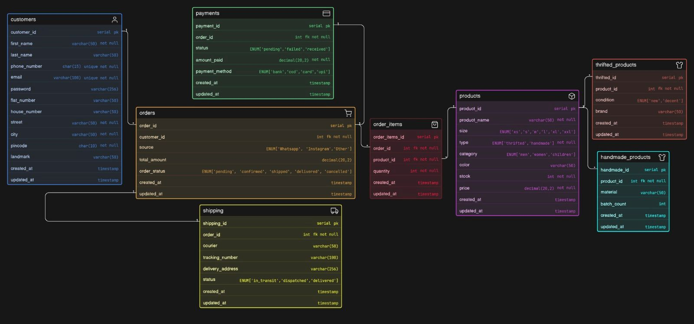

# Instagram Thrift Creator Store ER Diagram

ER Diagram designed as part of the **Web Dev Cohort 2026** databases assignment.

## About the Business

A small creator-run Instagram store that sells thrifted fashion items and handmade products. Orders are received via Instagram DMs and WhatsApp. The database is designed to help the owner manage products, track inventory, handle orders, and maintain payment and shipping records.

## Entities

## Key Design Decisions

The `products` table holds common fields while `thrifted_products` and `handmade_products` extend it for type-specific attributes. `condition` is stored only in `thrifted_products` since handmade items are new by default. `order_items` serves as the many-to-many junction table between `orders` and `products`. `payments` and `shipping` are kept separate from `orders` to keep the design normalized. The `source` field in orders tracks whether the order came via WhatsApp, Instagram, or other.

## Diagram

